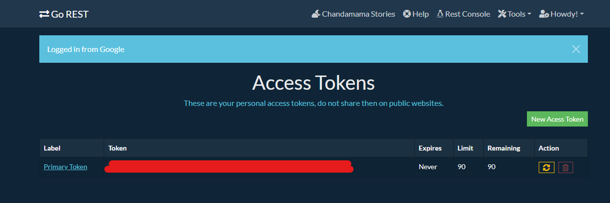

Aquí tienes una versión mejorada de tu archivo `README.md`:

---

# Playwright API Testing with Python

¡Hola! Mi nombre es Hernan, y en este repositorio comparto cómo trabajar con APIs utilizando Playwright con Python en modo síncrono. Espero que encuentres útil esta guía y que te ayude en tus proyectos.

## Cómo Ejecutar las Pruebas

### Ejecutar Pruebas Individuales
Puedes ejecutar pruebas individuales con los siguientes comandos:

```bash
pytest -v -s ./test_my_application.py
pytest -v -s ./test_list.py
pytest -v -s .\test_my_application.py
```

### Ejecutar Todas las Pruebas
Para ejecutar todas las pruebas juntas, simplemente ejecuta el siguiente comando desde la carpeta raíz:

```bash
pytest
```

## Instalación

### Instalación de Playwright y Pytest
Para comenzar, instala las siguientes herramientas y dependencias:

```bash
pip install pytest-playwright
playwright install
```

### Dependencias Adicionales
Además, necesitas instalar las siguientes dependencias:

```bash
pip install faker
pip install python-dotenv
```

### Instalar Todo de una Vez
También puedes instalar todas las dependencias con:

```bash
npm i
```


### En tu archivo .env:
Deberías tener las siguientes variables declaradas

BEARER_KEY=

BASE_URL=https://gorest.co.in

URL_USERS=/public/v2/users/

Para tener la BEARER KEY tienes que crearte una cuenta en https://gorest.co.in/consumer/login

